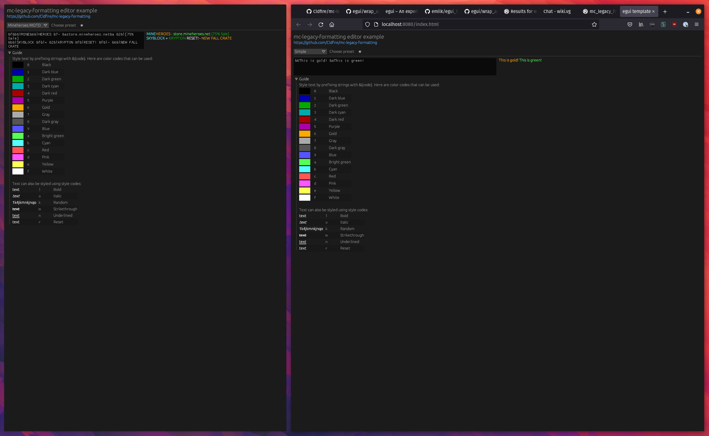

# mc-legacy-formatting

[](https://docs.rs/mc-legacy-formatting)
[](https://crates.io/crates/mc-legacy-formatting)
[](https://crates.io/crates/mc-legacy-formatting)

[](https://deps.rs/repo/github/cldfire/mc-legacy-formatting)

A parser for Minecraft's [legacy formatting system][legacy_fmt], created
with careful attention to the quirks of the vanilla client's implementation.

[Try it online!](https://cldfire.github.io/mc-legacy-formatting/)

## Features

* Iterator-based, non-allocating parser
* Supports `#![no_std]` usage (with `default-features` set to `false`)
* Implements the entire spec as well as vanilla client quirks (such as handling
  of whitespace with the `STRIKETHROUGH` style)
* Helpers for pretty-printing the parsed `Span`s to the terminal
* Support for parsing any start character for the formatting codes (vanilla
  uses `§` while many community tools use `&`)

## Examples

Using `SpanIter`:

```rust
use mc_legacy_formatting::{SpanExt, Span, Color, Styles};

let s = "§4This will be dark red §oand italic";
let mut span_iter = s.span_iter();

assert_eq!(span_iter.next().unwrap(), Span::new_styled("This will be dark red ", Color::DarkRed, Styles::empty()));
assert_eq!(span_iter.next().unwrap(), Span::new_styled("and italic", Color::DarkRed, Styles::ITALIC));
assert!(span_iter.next().is_none());
```

With a custom start character:

```rust
use mc_legacy_formatting::{SpanExt, Span, Color, Styles};

let s = "&6It's a lot easier to type &b& &6than &b§";
let mut span_iter = s.span_iter().with_start_char('&');

assert_eq!(span_iter.next().unwrap(), Span::new_styled("It's a lot easier to type ", Color::Gold, Styles::empty()));
assert_eq!(span_iter.next().unwrap(), Span::new_styled("& ", Color::Aqua, Styles::empty()));
assert_eq!(span_iter.next().unwrap(), Span::new_styled("than ", Color::Gold, Styles::empty()));
assert_eq!(span_iter.next().unwrap(), Span::new_styled("§", Color::Aqua, Styles::empty()));
assert!(span_iter.next().is_none());
```

### `editor-gui`

The [editor-gui](./editor-gui) folder contains a small Rust GUI program built on top of [egui](https://github.com/emilk/egui). This program runs both natively and on the web, providing a side-by-side editor experience that allows you to enter text using legacy format codes (prefixed by `&`) and instantly see the formatted output on the right-hand side.

[Try it online](https://cldfire.github.io/mc-legacy-formatting/) or see the [editor-gui README file](./editor-gui/README.md) for instructions on building it locally.



## MSRV

The Minimum Supported Rust Version is currently 1.48.0. This will be bumped to the latest stable version of Rust when needed.

#### License

<sup>
Licensed under either of <a href="LICENSE-APACHE">Apache License, Version
2.0</a> or <a href="LICENSE-MIT">MIT license</a> at your option.
</sup>

<br>

<sub>
Unless you explicitly state otherwise, any contribution intentionally submitted
for inclusion in this crate by you, as defined in the Apache-2.0 license, shall
be dual licensed as above, without any additional terms or conditions.
</sub>

[legacy_fmt]: https://wiki.vg/Chat#Colors
